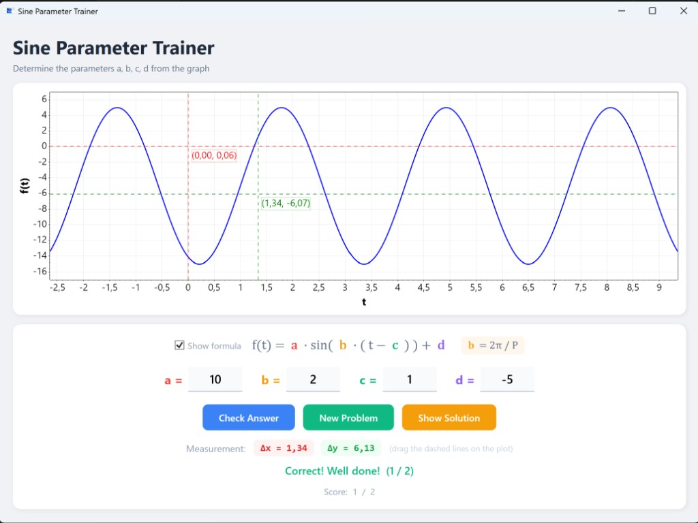

# Sine Parameter Trainer

A desktop learning tool that helps students practice reading the parameters of a general sine function from its graph.

The program generates random sine curves of the form

> **f(t) = a · sin( b · ( t − c ) ) + d**

and challenges the student to determine the four parameters **a**, **b**, **c**, and **d** by analysing the plotted curve.



---

## Features

- **Random curve generation** — each click of *New Problem* produces a fresh sine curve with randomised parameters.
- **Colour-coded formula** — the general formula is displayed with each parameter highlighted in its own colour, matching the input labels below.
- **Hideable formula** — uncheck *Show formula* for an extra challenge once the student is confident.
- **Helper formula** — the relationship **b = 2π / P** is shown alongside the main formula as a reminder.
- **Draggable measurement crosshairs** — two sets of dashed lines (red and green) can be dragged directly on the plot to measure distances. Each crosshair shows its **(x, y)** coordinate in a label box.
- **Live distance readout** — **Δx** and **Δy** between the two crosshairs are displayed in real time, making it easy to measure the period or amplitude.
- **Answer checking** — enter values for a, b, c, d and click *Check Answer*. The tool highlights which parameters are wrong. It also accepts mathematically equivalent representations (e.g. different phase shifts that produce the same curve).
- **Fraction input** — answers can be entered as decimals (`1.5`) or fractions (`3/2`).
- **Solution reveal** — click *Show Solution* to see the intended parameter values.
- **Score tracking** — keeps a running score of correct answers vs. total attempts.

---

## Parameter Ranges

| Parameter | Role | Range | Type |
|-----------|------|-------|------|
| **a** | Amplitude | 1 to 10 | Positive integer |
| **b** | Frequency (period P = 2π/b) | 1 to 4 | Positive integer |
| **c** | Phase shift | Depends on b (kept < half-period) | Integer |
| **d** | Vertical shift | −5 to 5 | Integer |

---

## Download & Installation

The application is a self-contained Windows executable — **no additional software or runtime installation is required**.

1. Download **`SineParameterTrainer.exe`** from the [Releases page](https://github.com/holgerschl/SineParameterTrainer/releases/latest).

2. Save it to any location on your computer.

3. Double-click the file to start the application — that's it!

> **Note:** The download is a single ~70 MB file. Everything is bundled inside — no extraction or installation needed.

---

## How to Use

### 1. Read the graph

When the application starts (or after clicking **New Problem**), a sine curve is plotted. Your task is to determine the four parameters:

- **a** (amplitude) — the height from the centre line to a peak. Read it as half the distance between the maximum and minimum values.
- **b** (frequency) — related to the period P by **b = 2π / P**. Measure the period (horizontal distance for one full cycle) using the crosshairs, then calculate b.
- **c** (phase shift) — the horizontal shift. Find where the curve crosses its centre line going upward; that t-value is c.
- **d** (vertical shift) — the centre line of the oscillation. Calculate as (max + min) / 2.

### 2. Use the measurement crosshairs

Drag the **red** and **green** dashed lines on the plot to measure distances:

- Place the two **vertical** dashed lines on consecutive peaks (or troughs) to measure the **period** (shown as Δx).
- Place the two **horizontal** dashed lines on a peak and a trough to measure **2·a** (shown as Δy).
- Each crosshair displays its exact **(x, y)** coordinates in a label.

### 3. Enter your answer

Type your values for a, b, c, and d into the input fields. You can use:
- Integers: `3`
- Decimals: `1.5`
- Fractions: `3/2`

Press **Enter** or click **Check Answer** to verify.

### 4. Get feedback

- **Correct** — you'll see a green confirmation and your score increases.
- **Incorrect** — the tool tells you which parameters to re-check.
- Click **Show Solution** if you're stuck, to reveal the intended values.

### 5. Increase difficulty

Uncheck **Show formula** to hide the formula and the b = 2π/P hint, forcing you to recall the relationships from memory.

---

## Tech Stack

- **C# / .NET 10** — Windows desktop application
- **WPF** — UI framework
- **ScottPlot 5** — interactive plotting library
- **CommunityToolkit.Mvvm** — MVVM pattern with source generators
- **Microsoft.Extensions.DependencyInjection** — dependency injection

---

## Project Structure

```
SineParameterTrainer/
├── Models/
│   └── SineParameters.cs          # Parameter record
├── Services/
│   ├── ISineCurveService.cs        # Service interface
│   └── SineCurveService.cs         # Random parameter generation
├── ViewModels/
│   └── MainViewModel.cs            # Application logic & state
├── Converters/
│   └── StringToBrushConverter.cs   # Hex colour string → WPF Brush
├── MainWindow.xaml                 # UI layout
├── MainWindow.xaml.cs              # Plot rendering & crosshair dragging
├── App.xaml / App.xaml.cs          # DI container & startup
├── icon.png                        # Application icon
└── screenshot.png                  # Screenshot for documentation
```

---

## Code Signing Policy

Release builds are produced exclusively by [GitHub Actions](.github/workflows/release.yml) from the source code in this repository. The build pipeline is fully automated and reproducible.

**Team roles:**
- Approver & Committer: [holgerschl](https://github.com/holgerschl) (repository owner)

**Privacy policy:**
This program will not transfer any information to other networked systems unless specifically requested by the user or the person installing or operating it.

---

## License

MIT License — see [LICENSE](LICENSE) for details.
